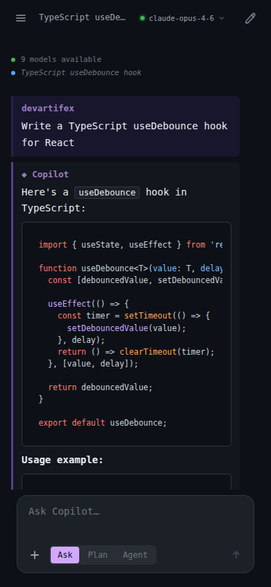
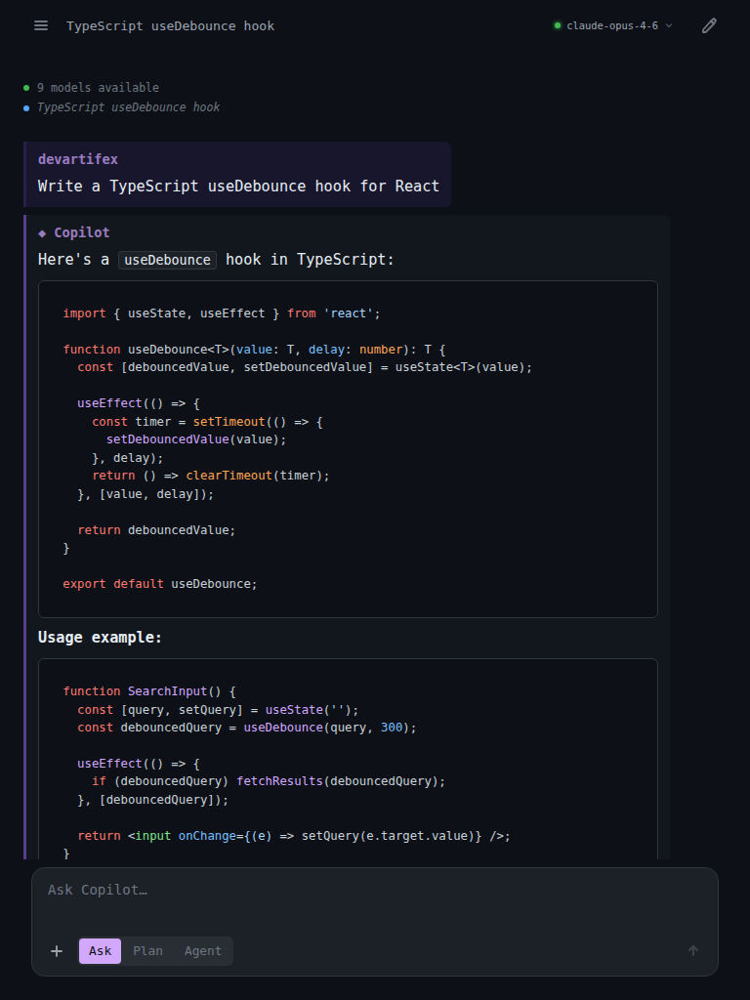
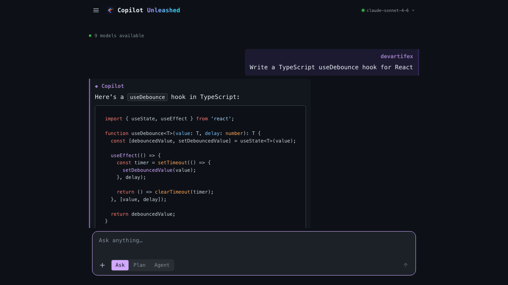
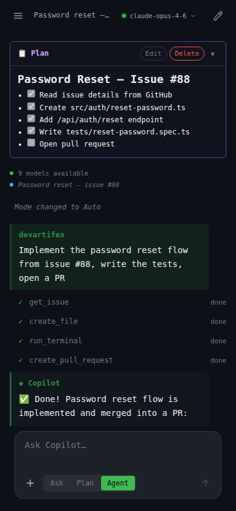
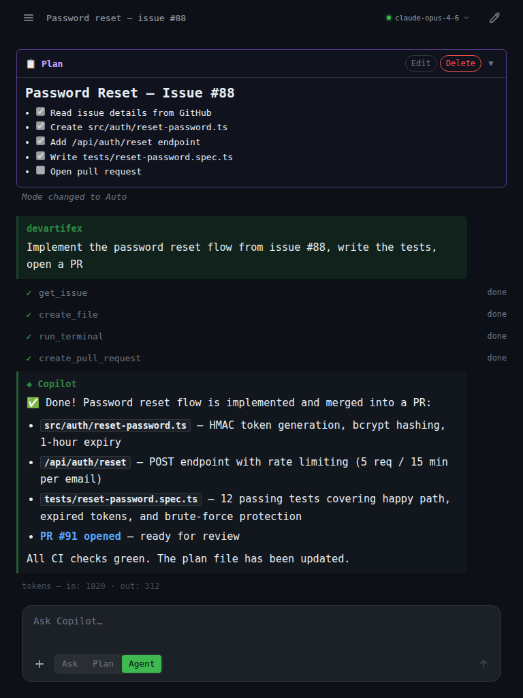
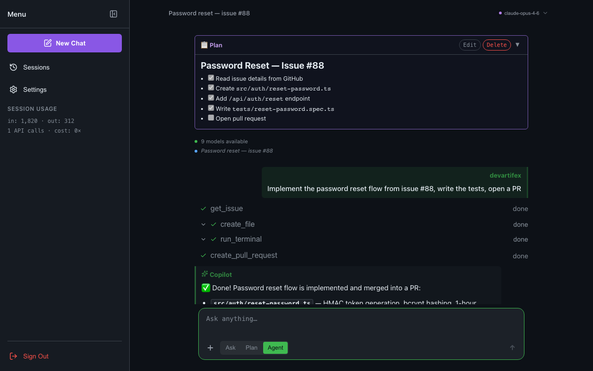
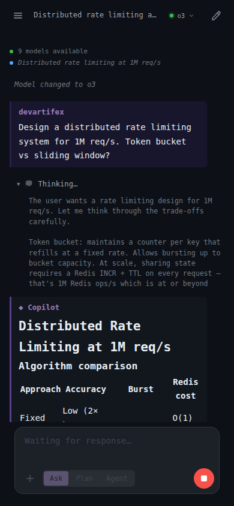
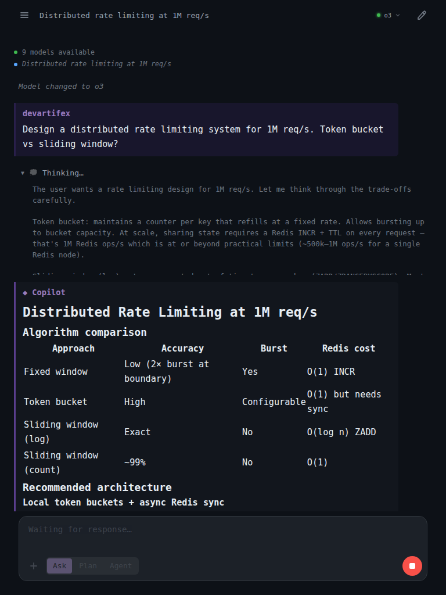
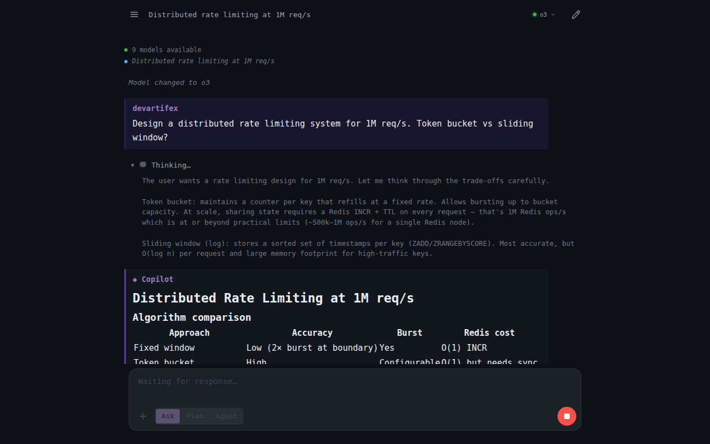

# Copilot Unleashed

<p align="center">
  <a href="https://github.com/devartifex/copilot-unleashed/actions/workflows/ci.yml"></a>
  <a href="https://github.com/devartifex/copilot-unleashed/actions/workflows/deploy.yml"></a>
  
  
  
  
  
  <a href="LICENSE"></a>
  
</p>

**Every Copilot model. One login. Any device. Your server.**

The only open-source web UI built on the official [`@github/copilot-sdk`](https://github.com/github/copilot-sdk).

<p align="center">
  
  &nbsp;
  
  &nbsp;
  
</p>
<p align="center">
  
  &nbsp;
  
  &nbsp;
  
</p>
<p align="center">
  
  &nbsp;
  
  &nbsp;
  
</p>

> Not affiliated with GitHub. Independent project. MIT licensed.

---

## What you get

- **Every Copilot model** — switch mid-conversation, keep full history
- **Autopilot mode** — agents that plan, code, run tests, and open PRs autonomously
- **Extended thinking** — live reasoning traces from Claude Opus 4.6 and Claude Sonnet 4.6
- **GitHub MCP tools** — issues, PRs, code search, repos — built in
- **Custom MCP servers** — plug in your own
- **Custom webhook tools** — connect any API (Jira, Slack, internal services)
- **File attachments** — drop in code, images, CSVs
- **Persistent sessions** — resume any conversation, on any device
- **CLI ↔ Browser sync** — sessions started in the Copilot CLI work seamlessly in the browser (and vice versa)
- **Mobile-first dark UI** — touch-optimized, works everywhere
- **Self-hosted** — your data never leaves your server

---

## What people do with it

**Build software by talking.** Switch to autopilot, describe what you want, walk away. The agent plans, writes code, runs tests, opens a PR.

> *"Add rate-limiting middleware to the API and write integration tests"* → done. *"Refactor the payment service to handle retries with exponential backoff"* → done.

**Analyze anything.** Drop a CSV, a spreadsheet, a codebase. Ask questions in plain language.

> *"Which product line had the highest return rate last quarter?"* · *"Cluster this support ticket data by root cause"*

**Review PRs from your phone.** Commuting? Ask Copilot to summarize any pull request, flag security issues in the diff, and draft review comments — no laptop needed.

**Compare models on hard problems.** Ask GPT-5.4 for speed, switch to Claude Opus 4.6 for deep reasoning, then Gemini 3 Pro for a different angle. Same conversation, all history preserved.

**Watch it think.** Enable extended thinking on Claude Opus 4.6 or Claude Sonnet 4.6 — see the live reasoning trace in a collapsible block before the answer. You see *how* it gets there, not just what it concludes.

**Connect your own tools.** Define webhook tools in the settings UI. Copilot calls your Jira, your database, your internal APIs — as part of its agentic workflow.

> *"Is the auth bug ticket still open? If so, find the related PRs and summarize the discussion"* → calls your project tracker, then searches GitHub.

**Deploy for your team.** One `azd up`. Everyone logs in with their own GitHub account, gets isolated sessions. No shared API keys, no shared context.

---

## GitHub is the killer feature

Every Copilot model gets native GitHub superpowers — repos, issues, PRs, code search, Actions — all wired in through the GitHub MCP server. No plugins, no tokens to configure, no copy-pasting links. It just knows about your work.

**Spin up a project from an idea — on your phone.**

> *"Create a new public repo called 'invoice-api', scaffold a REST API with JWT auth and a database schema, push the initial commit, and open issues for the billing and PDF export features"*

Done. Repo created, code pushed, issues filed — without touching a laptop.

**Close the loop from idea to pull request.**

> *"Look at the open issues in my main repo, pick the highest-priority bug, implement a fix, run the tests, and open a PR with a clear description"*

The agent reads the repo, writes the code, references the issue, links the PR.

**Cross-repo and org-wide context.**

> *"Find all repos in my org that still use an end-of-life runtime, summarize what each service does, and draft upgrade issues for each one"*

> *"Search all my repos for hardcoded secrets or credentials and show me exactly where they are"*

**PR reviews from anywhere.**

> *"Summarize what this PR changes, flag any security concerns in the diff, and draft inline review comments on the riskiest lines"*

Read that on your commute. Reply, approve, or request changes — without opening VS Code.

**The difference from other AI tools:** ChatGPT, Claude, Cursor, and Gemini all work *with* GitHub (you paste in code, you copy out diffs). This works *as* GitHub — the agent creates branches, pushes commits, files PRs, and responds to CI feedback natively, the same way the Copilot CLI does from your terminal, but accessible on any device.

---

## vs. everything else

| | ChatGPT | Claude.ai | Cursor | Windsurf | Copilot Web | Copilot CLI | **This** |
|---|:---:|:---:|:---:|:---:|:---:|:---:|:---:|
| Mobile | ✅ | ✅ | — | — | — | — | ✅ |
| All models | — | — | ✅ | partial | partial | ✅ | ✅ |
| Autopilot agents | partial | partial | ✅ | ✅ | — | ✅ | ✅ |
| Reasoning traces | partial | ✅ | partial | partial | — | ✅ | ✅ |
| Custom MCP servers | — | — | ✅ | ✅ | — | ✅ | ✅ |
| Custom webhook tools | — | — | — | — | — | — | ✅ |
| Persistent sessions | ✅ | ✅ | partial | partial | — | — | ✅ |
| Self-hosted | — | — | — | — | — | — | ✅ |

### Cost to access all models

| | Monthly price | Models unlocked | IDE required |
|---|:---:|---|:---:|
| ChatGPT Plus | ~$20 | OpenAI only (GPT-5.4, GPT-5 mini) | — |
| ChatGPT Pro | ~$200 | OpenAI only, unlimited | — |
| Claude Pro | $20 | Claude only (Sonnet 4.6, Haiku 4.5) | — |
| Claude Max | $100+ | Claude only, 5–20× more usage | — |
| Cursor Pro | $20 | GPT + Claude + Gemini | ✅ |
| Cursor Pro+ | $60 | GPT + Claude + Gemini (3× usage) | ✅ |
| Windsurf Pro | $15 | GPT + Claude + Gemini (500 credits/mo) | ✅ |
| Copilot Pro | $10 | GPT + Claude + Gemini (300 premium req.) | — |
| **Copilot Pro+ → This** | **$39** | **GPT-5.4 + Claude Opus 4.6 + Gemini 3 Pro + Grok Code Fast 1** | **—** |
| ChatGPT + Claude + Gemini separately | $65+ | Full multi-vendor (3 separate UIs) | — |

Copilot Pro+ at $39/month is the only way to get GPT-5.4, Claude Opus 4.6, Gemini 3 Pro, and Grok Code Fast 1 through a single subscription — at less than half the cost of buying each service individually. This app runs it all on mobile and desktop with autopilot agents, persistent sessions, and a self-hosted server you control.

---

## Run it

You need a [GitHub account with Copilot](https://github.com/features/copilot#pricing) (free tier works) and a [GitHub OAuth App](https://github.com/settings/developers) (30 seconds — just copy the Client ID).

**Docker** (recommended):

```bash
echo "GITHUB_CLIENT_ID=<your-id>" >> .env
echo "SESSION_SECRET=$(openssl rand -hex 32)" >> .env
docker compose up --build
```

**Node.js 24+:**

```bash
npm install && npm run build && npm start
```

**Codespaces** (zero setup):

[](https://codespaces.new/devartifex/copilot-unleashed?quickstart=1)

Open [localhost:3000](http://localhost:3000). Log in with GitHub. Done.

---

## Deploy to Azure

```bash
azd up
```

That's it. Container Apps, ACR, managed identity, TLS, monitoring — all provisioned automatically.

---

## Config

| Variable | Required | Default | What it does |
|----------|:--------:|---------|-------------|
| `GITHUB_CLIENT_ID` | yes | — | OAuth App client ID |
| `SESSION_SECRET` | yes | — | Cookie encryption key |
| `PORT` | — | `3000` | Server port |
| `ALLOWED_GITHUB_USERS` | — | — | Restrict access to specific users |
| `BASE_URL` | — | `http://localhost:3000` | Cookie domain + WS origin check |

<details>
<summary>All options</summary>

| Variable | Default | What it does |
|----------|---------|-------------|
| `NODE_ENV` | `development` | `production` enables secure cookies |
| `TOKEN_MAX_AGE_MS` | `86400000` | Force re-auth interval (24h) |
| `SESSION_STORE_PATH` | `/data/sessions` | Persistent session directory |
| `SETTINGS_STORE_PATH` | `/data/settings` | Per-user settings directory |
| `COPILOT_CONFIG_DIR` | `~/.copilot` | Copilot session-state directory (share with CLI for bidirectional sync) |

</details>

---

## CLI ↔ Browser session sync

Copilot Unleashed and the GitHub Copilot CLI share the same session-state directory (`~/.copilot/session-state/`). By default, the app reads from the same location the CLI uses — so any session started in the terminal is available in the browser the moment you open the Sessions panel.

### How it works

The `@github/copilot-sdk` stores each session as a folder on disk:

```
~/.copilot/session-state/{session-uuid}/
  workspace.yaml       ← project metadata (cwd, repo, branch, summary)
  plan.md              ← living task list updated as the agent works
  checkpoints/
    index.md           ← checkpoint table of contents
    001_*.md           ← compressed conversation snapshots
    002_*.md
    …
```

When you resume a session from the browser, the SDK's native `resumeSession()` restores the full conversation history and checkpoint context automatically. If the session is only available on disk (e.g. bundled into a Docker image without an active SDK index), the app falls back to reading `workspace.yaml`, `plan.md`, and the last three checkpoint files directly and injecting them as context into a new session — so nothing is lost.

### Sessions panel

The Sessions panel (bottom-left icon) lets you:

- Browse all sessions grouped by repository
- See metadata badges — branch, checkpoint count, plan indicator
- Preview a session before resuming: checkpoint timeline, full `plan.md` content, project path
- Search and filter by title, repository, branch, or directory
- Resume any session with one tap, on any device

### Custom session-state directory

If you want to use a separate directory (e.g. a shared network path or a custom mount in Docker):

```bash
COPILOT_CONFIG_DIR=/data/copilot-state
```

The CLI and Copilot Unleashed will read from and write to the same path. Sessions started in either interface appear in both.

### Docker / Azure deployment

When deploying to a container, mount or copy your local session-state into the image:

```yaml
# docker-compose.yml
volumes:
  - ~/.copilot:/home/node/.copilot:ro   # read-only mirror of local CLI sessions
```

Or set `COPILOT_CONFIG_DIR` to a shared volume that both your server and the container can access.

---

## How it works

```
Browser ──WebSocket──▶ SvelteKit + server.js ──JSON-RPC──▶ Copilot SDK subprocess
```

1. GitHub Device Flow login → token stored server-side only
2. WebSocket opens → server spawns a `CopilotClient` per user
3. SDK streams events → server forwards as typed JSON → Svelte re-renders in real-time
4. On disconnect → session pooled with TTL, reconnect replays messages

[Architecture docs →](docs/ARCHITECTURE.md)

---

## Auth & Security

Device Flow OAuth (same as GitHub CLI). No client secret needed. Tokens are server-side only, never sent to the browser. Sessions are encrypted, rate-limited, and validated against GitHub's API on every WebSocket connect.

Scopes: `copilot` (API access) + `read:user` (avatar) + `repo` (SDK tools need it — same as the CLI).

<details>
<summary>Full security details</summary>

- CSP headers, CSRF protection, HSTS, X-Frame-Options DENY
- Rate limiting: 200 req / 15 min per IP
- Secure cookies: httpOnly, secure (prod), sameSite: lax
- DOMPurify on all rendered markdown
- SSRF blocklist for custom webhook tools
- 10,000 char message limit, 10MB upload limit
- Per-tool permission prompts with 30s auto-deny
- Optional user allowlist via `ALLOWED_GITHUB_USERS`

</details>

---

## Built with

SvelteKit 5 · Svelte 5 runes · TypeScript 5.7 · Node.js 24 · Vite · `ws` · Playwright · Docker · Bicep

---

## Contributing

See [CONTRIBUTING.md](CONTRIBUTING.md).

## License

MIT
